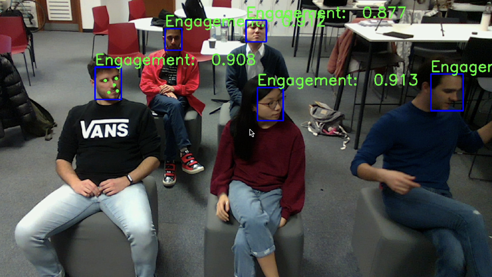

# RoboLecturer
## Overview
This project is part of the Human-Centred Robotics module at Imperial College London's Department of Electrical Engineering.

This project develops RoboLecturer, a robot designed to deliver lectures to a small class of students using slides uploaded by the lecturer. Using Softbank Robotics' Pepper robot, several sub-modules were developed and integrated to allow RoboLecturer to:
- Interact with the students
- Answer their questions
- Collect metrics for evaluation of class performance

## Functions
RoboLecturer's lectures are carried out in four main steps according to the flow diagram.

  

**0. Pre-processing**: The lecturer uploads slides on the Web Server, which are parsed for text and sent to NLP. NLP then generates lecture scripts for each slides and sends them to Speech, which converts the text to audio files.
|  |  |
|:--:|:--:|
| *Parsing text from uploaded slides* | *Generation of lecture script* |

**1. Lecture deliverance**: RoboLecturer delivers the lecture script for the current slide, engaging arm and hand movements to appear more natural.

  
   
  (click for sound)

**2. Question and Answer**: After delivering the lecture, RoboLecturer asks for questions, scans for raised hands, and answers the students' questions.
|  |  |
|:--:|:--:|
| *Pointing at student with raised hand* | *Snippet of answer to the question "What is the shape of our galaxy?" (click for sound)* |

**3. Engagement Detection**: After QnA, RoboLecturer scans the room for inattentiveness by detecting face engagement and high noise. If attentiveness is detected, the robot makes a joke, tells the students to quiet down, or starts a quiz to revitalize the lecture.

  
   
  Detection of face engagement using YOLOv7

