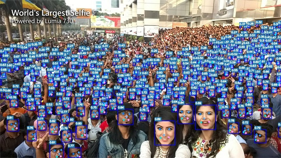

# YOLOv7-face

#### Dataset

[WiderFace](http://shuoyang1213.me/WIDERFACE/)

[yolov7-face-label](https://drive.google.com/file/d/1FsZ0ACah386yUufi0E_PVsRW_0VtZ1bd/view?usp=sharing)

#### Demo

### Installation

Run
'''
pip install -r requirements.txt
'''
OBS: not all packages are included in the file above. Install manually if required.

### Predict

For Pepper, change the variable '''frame''' in '''main.py''' to camera frame and run
'''
python main.py --weights utils/models/YOLOface/weights/yolov7s-face.pt --save-txt --nosave
'''

All the coordinates for the bounding boxes of detected faces will be returned as a list in the variable '''face_coods'''.
Each element of the list is normalized with respect to the size of the image and has the the format '''[x_center y_center width height]'''. For a frame of size MxN, you can calculate the coordinates (in pixels) by doing '''[M\*x_center N\*y_center M\*width N\*height]'''

#### References

* [https://github.com/deepcam-cn/yolov5-face](https://github.com/deepcam-cn/yolov5-face)

* [https://github.com/derronqi/yolov7-face](https://github.com/derronqi/yolov7-face)

* [https://github.com/WongKinYiu/yolov7](https://github.com/WongKinYiu/yolov7)

* [https://github.com/TexasInstruments/edgeai-yolov5/tree/yolo-pose](https://github.com/TexasInstruments/edgeai-yolov5/tree/yolo-pose)

* [https://github.com/ppogg/YOLOv5-Lite](https://github.com/ppogg/YOLOv5-Lite)
